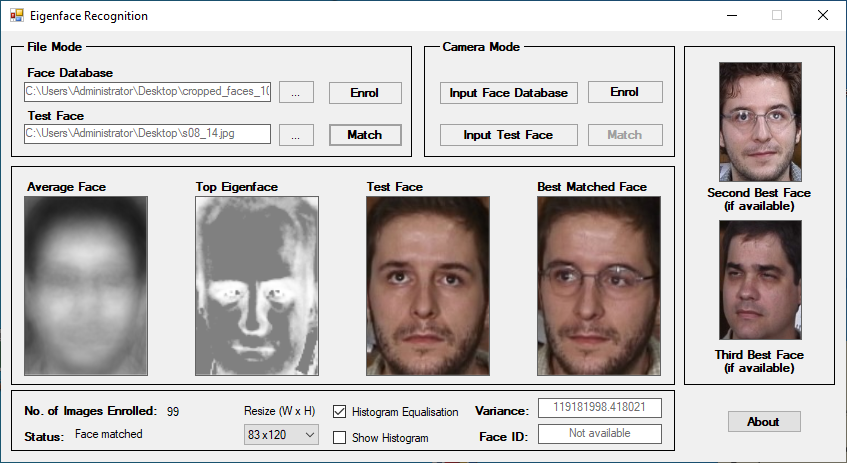
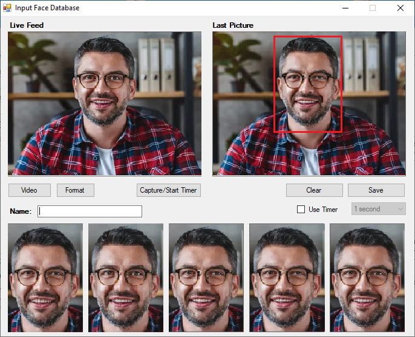
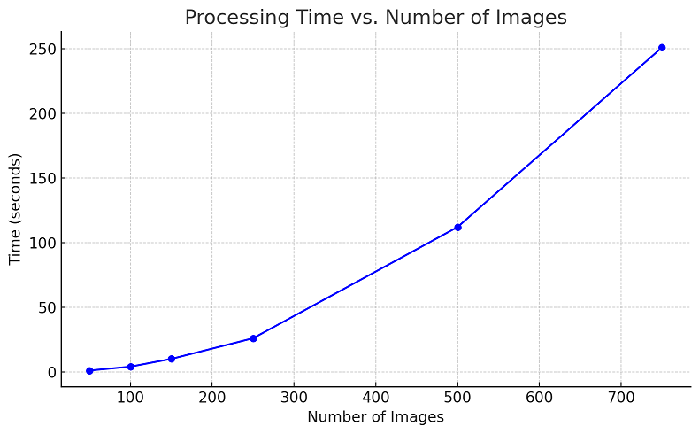

# Eigenface Recognition

A small and lightweight application utilising eigenvectors to demonstrate human face recognition.

The VB.NET WinForms application aims to retreive the nearest image in an enrolled dataset of faces, utilising additioanl pre-processing techniques to improve accuracy.

I completed this work as part of an undergraduate degree at King's College London, accompanied by a paper titled ***"An Investigation into Biometric Recognition for Mobile Devices"***.

> The application with face images enrolled

> Histograph equalisation is an optional pre-processing step to reduce lighting variation

> Images can be captured from a video source, such as a USB camera

**Features**
- Enrol up to 1000 images from disk
- Supports image capture from a video source, like USB webcameras
- Supports images of any size, with variable resize option
- Apply historgram equalisation to minimise impact of lighting variation
- Attempt matching of a single input face

## Why

I was curious to revist the project, and after fixing deprecated code, I thought I'd upload a working version for anyone else interested in this domain.

## Running Eigenface Recognition
I've included a packaged executible with the necessary libraries. You can always compile the source yourself.

## Notes
- Eignface approach to face recognition doesn't necessarily scale as the number of input images grows (especially in the naive appraoch utilised here), hence there is an upper bound of 1000 images for enrollment.  We observe at least a quadratic time-complexity (see table below)
- The image dimension increases the number of data points for which the covariance matrix needs to be computed, and thus compute time. A default resize dimension of 24x60 is recommended for increasing datasets, which might impact accuracy
- Eignfaces are notorisuly suspectible to face position, expression, and lighting as a minimum. The best input images are frontfacing, with good lighting, and with the face almost entirly the content of the image

## Acknowledgements
- [Mapack linear algebra library for .NET](https://github.com/filgood/Mapack)
- [AForge.NET video input library](https://github.com/andrewkirillov/AForge.NET)
- [Sample face dataset from Georgia Institute of Technology](https://www.anefian.com/research/face_reco.htm)
