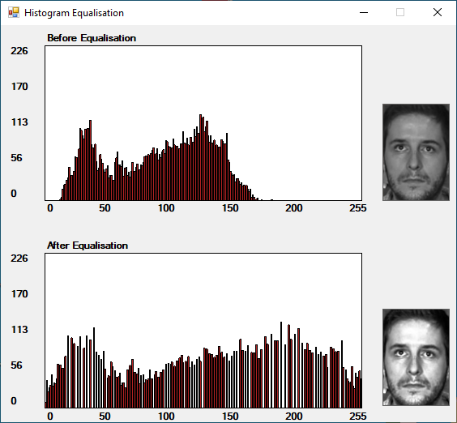

# Eigenface Recognition

A small and lightweight application utilising eigenvectors to demonstrate human face recognition, in the field of computer vision.

The VB.NET WinForms application aims to retreive the nearest image in an enrolled dataset of faces, utilising additioanl pre-processing techniques to improve accuracy.

I completed this work as part of an undergraduate degree at King's College London, accompanied by a paper titled ***"An Investigation into Biometric Recognition for Mobile Devices"***.

> The application with face images enrolled

> Images can be captured from a video source, such a USB camera

> Histograph equalisation is an optional pre-processing step to reduce lighting variation

**Features**
- Enrol up to 1000 images from disk
- Supports image capture from a video source, like USB webcameras
- Supports images of any size, with variable resize option
- Apply historgram equalisation to minimise impact of lighting variation
- Attempt matching of a single input face

## Why

I was curious to revist the project, and after fixing deprecated code, I thought I'd upload a working version for anyone else interested in this domain.

## Running Eigenface Recognition
I've included a packaged executible with the necessary libraries. You can always compile the source yourself.

## Notes
- 

## Acknowledgements
- [Mapack linear algebra library for .NET](https://github.com/filgood/Mapack)
- [AForge.NET video input library](https://github.com/andrewkirillov/AForge.NET)
- [Sample face dataset from Georgia Institute of Technology](https://www.anefian.com/research/face_reco.htm)